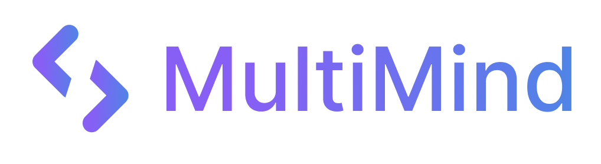

<!--Add commentMore actions
  MultiMind SDK - Unified AI Development Toolkit
  MultiMind SDK - Unified AI Development Toolkit in development
  Description: A powerful Python SDK for fine-tuning, RAG systems, and AI agent development
  Keywords: AI development, fine-tuning, RAG, LLM, machine learning, Python SDK, LangChain, CrewAI, LiteLLM, SuperAGI
  Author: AI2Innovate Team
  Version: 0.1.0
-->

<!-- Logo -->

  

<h1 align="center">MultiMind SDK: Unified AI Development Toolkit</h1>

  <strong>Build, Fine-Tune, and Deploy Advanced AI Applications with Ease</strong>

  
  

  <h2>🚧 Project Status: In Active Development 🚧</h2>
  
Join the future of AI development! We're actively building MultiMind SDK and looking for contributors. Check our <a href="https://github.com/multimindlab/multimind-sdk/tree/develop/docs/TODO.md">TODO list</a> to see what's implemented and what's coming next. Connect with our growing community on <a href="https://discord.gg/K64U65je7h" aria-label="Join MultiMind SDK Discord Community">Discord</a> to discuss ideas, get help, and contribute to the project.

## 🚀 Why MultiMind SDK?

> 🧠 **MultiMind SDK is the only open-source toolkit that unifies Fine-Tuning, RAG, and Agent Orchestration** — all in one modular, extensible Python framework.
Forget silos. While others focus on chaining, agents, or retrieval alone, **MultiMind integrates them into one coherent developer-first experience**, with:
- 🪄 Declarative YAML + CLI + SDK interfaces
- 📚 RAG with hybrid (vector + knowledge graph) retrieval
- 🤖 Role-based agents with memory, tools, and task flow
- 🔁 Self-improving agents with cognitive loop support
- 🔐 Enterprise-ready: logging, compliance, GDPR, cost tracking
- 🌍 Cloud + Edge deploy (Jetson, RPi, Offline mode)

📑 Check out our [Strategic Roadmap](https://github.com/multimindlab/multimind-sdk/tree/develop/docs/roadmap.md) to see where we're headed!

### Key Benefits

- **🚀 Unified Interface**: Streamline your AI development with one consistent API
- **💡 Production-Ready**: Enterprise-grade deployment, monitoring, and scaling
- **🛠️ Framework Agnostic**: Seamless integration with LangChain, CrewAI, and more
- **🔌 Extensible**: Customizable architecture for your specific needs
- **📊 Enterprise Features**: Comprehensive logging, monitoring, and cost tracking

